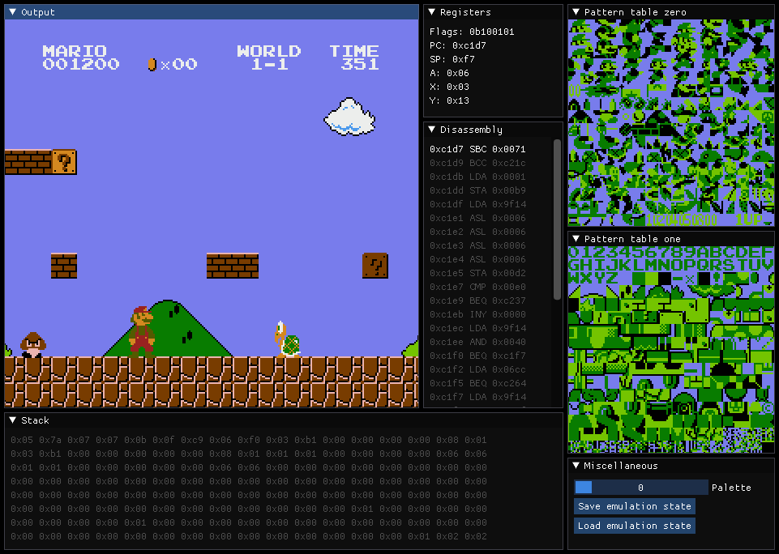
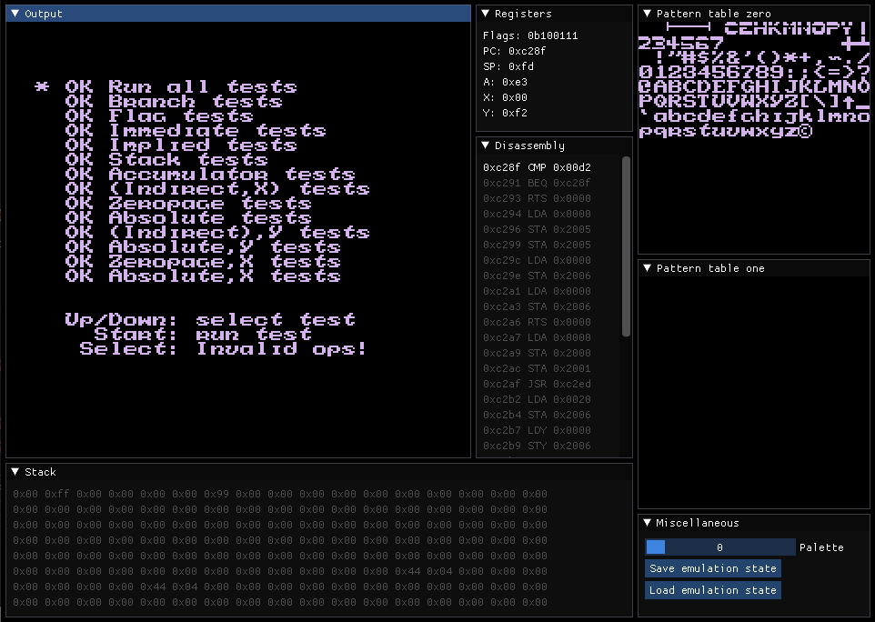

# nes-emulator-rust
An NES emulator written in Rust, with an inbuilt visual debugger

| Super Mario Bros. | Donkey Kong | nestest |
| - | - | - |
||
||

# Building
You will need to install [SDL2](https://github.com/Rust-SDL2/rust-sdl2) for Rust as per the instructions.
```
git clone https://github.com/lukawarren/nes-emulator-rust.git
cd nes-emulator-rust
cargo build --release
```

# Running
While in development:
```
cargo run --release [rom_file.nes]
```

As a standalone executable:
```
./nes-emulator-rust [rom_file.nes]
```

# Supported platforms
The project is built with [OpenGL](https://github.com/glium/glium), [SDL2](https://github.com/Rust-SDL2/rust-sdl2) and [ImGui](https://github.com/michaelfairley/rust-imgui-sdl2), and
as such it should work on any platform where OpenGL is supported. It has been confirmed to run on:
* Windows
* Linux
* Mac OS
